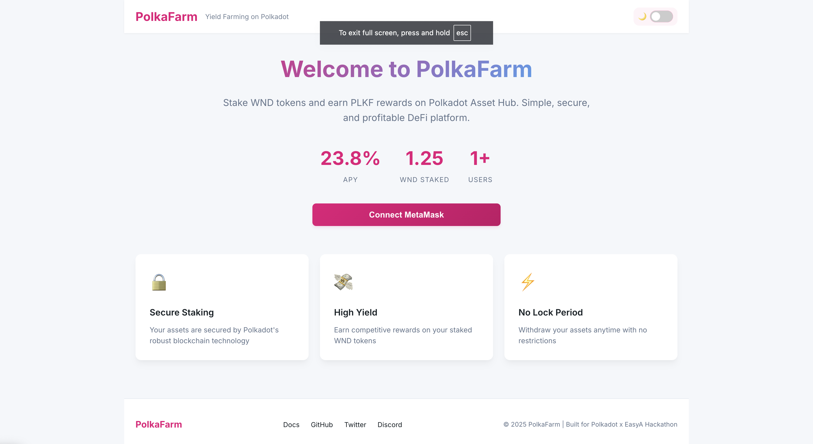
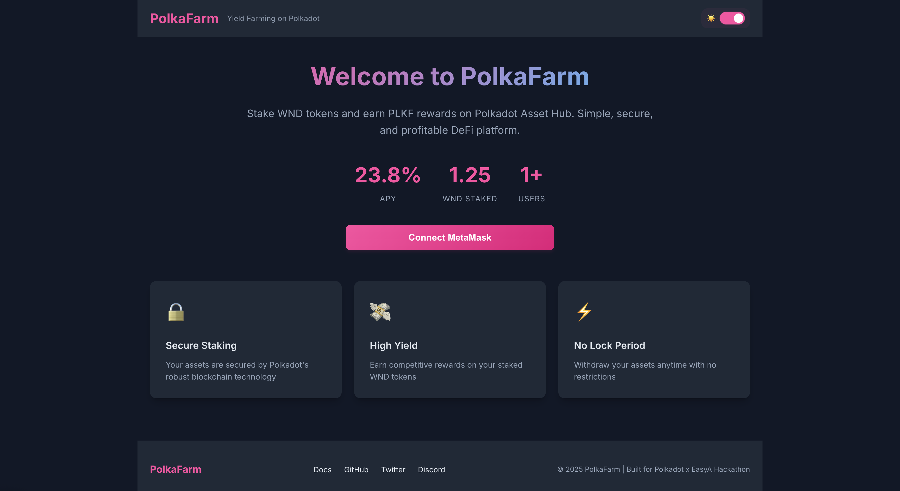
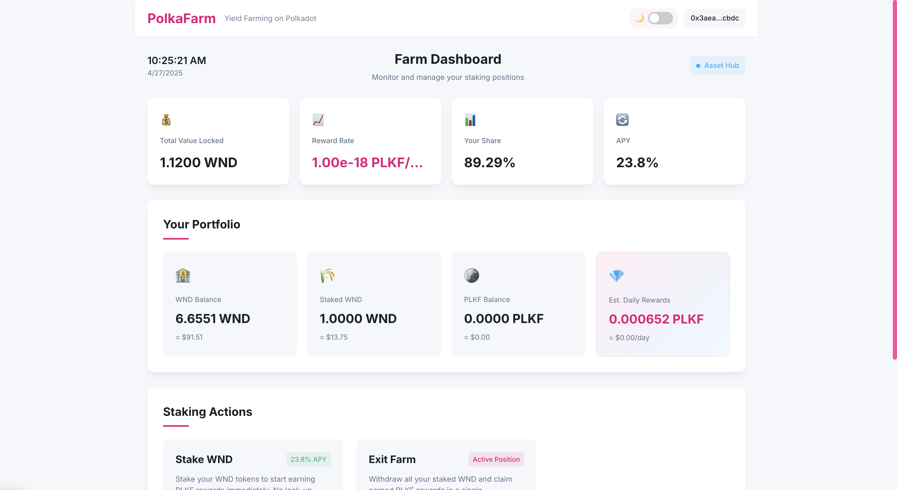
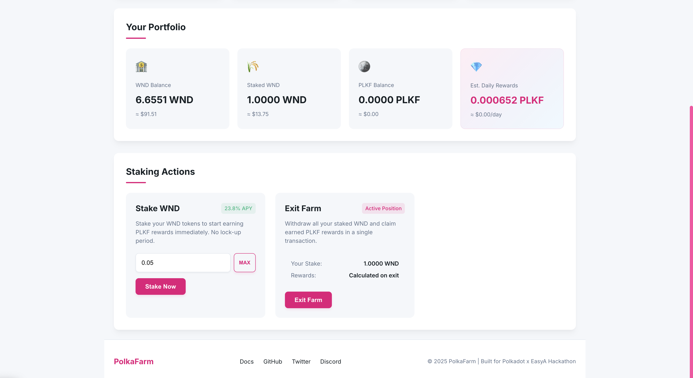
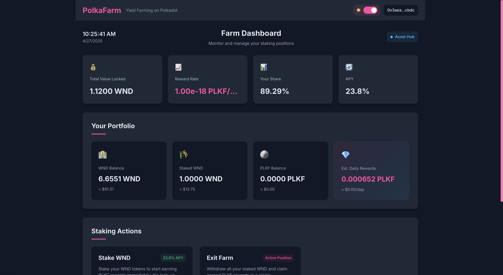
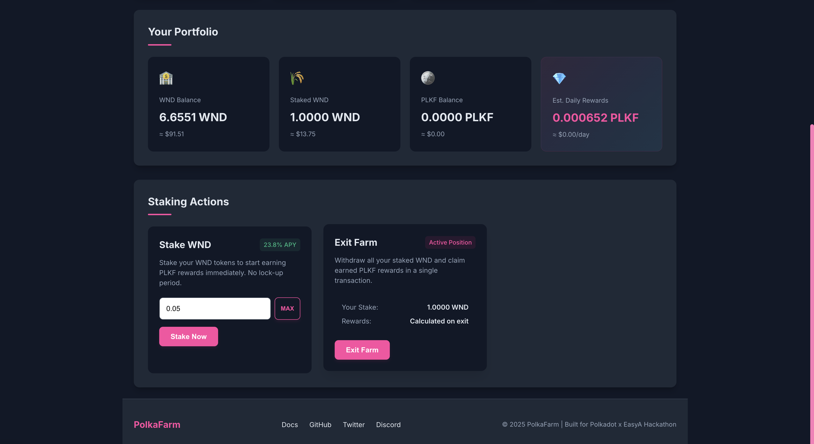

<div align="center">
  
  <h1>PolkaFarm: DeFi Yield Farming on Polkadot Asset Hub</h1>
  <p><i>A secure, user-friendly yield farming DApp enabling WND staking with PLKF rewards</i></p>
</div>

<div align="center">
  
  <p><b>Created by:</b> Cole Dermott</p>
  <p><b>Team:</b> Waterloo Blockchain Sweat • <b>Contact:</b> <a href="mailto:cdermott@uwaterloo.ca">cdermott@uwaterloo.ca</a></p>
</div>

## Overview

PolkaFarm is a decentralized yield farming application built on Polkadot Asset Hub. It allows users to stake WND tokens (native token of Westend testnet) and earn PLKF reward tokens. This project demonstrates a DeFi primitive on Polkadot's new smart contract platform, showcasing cross-chain capabilities, shared security, and scalability benefits.

## Table of Contents
- [Demo Video](#demo-video)
- [Features](#features)
- [Screenshots](#screenshots)
- [Smart Contracts](#smart-contracts)
- [Repository Structure](#repository-structure)
- [Getting Started](#getting-started)
- [How PolkaFarm Utilizes Polkadot's Asset Hub](#how-polkafarm-utilizes-polkadots-asset-hub)
- [Known Issues and Workarounds](#known-issues-and-workarounds)
- [Architecture](#architecture)
- [Project Description](#polkafarm-project-description)
- [License](#license)

## Demo Video

[](https://youtu.be/YOUR_VIDEO_ID)

*Click the image above to watch the full demo video explaining PolkaFarm's architecture and features.*

> This comprehensive demo showcases how PolkaFarm leverages Polkadot Asset Hub's features for secure staking and reward distribution, with a walkthrough of the codebase and live demonstration.

## Features

- Stake native WND tokens to earn PLKF rewards
- Early withdrawal penalty to incentivize longer staking periods
- Simple, clean UI for staking, withdrawing, and claiming rewards
- Light and dark mode support for better user experience
- Fully built on Polkadot Asset Hub using Solidity

## Screenshots

### Landing Page - Light Mode

*The welcoming landing page showcasing key statistics and features in light mode*

### Landing Page - Dark Mode

*The same landing page in dark mode for comfortable nighttime use*

### Dashboard Top - Light Mode

*Clean dashboard interface in light mode showing staking statistics*

### Dashboard Bottom - Light Mode

*Portfolio view and staking actions in light mode*

### Dashboard Top - Dark Mode

*Dashboard interface in dark mode showing staking statistics*

### Dashboard Bottom - Dark Mode

*Portfolio view and staking actions in dark mode*

## Smart Contracts

- `PolkaFarmToken.sol`: ERC-20 token for rewards (PLKF)
- `PolkaFarmStaking.sol`: Staking contract that handles deposits, withdrawals, and reward distribution

## Repository Structure

```
polkafarm/
├── contracts/                 # Smart contract source code
│   ├── PolkaFarmToken.sol     # PLKF reward token contract
│   └── PolkaFarmStaking.sol   # WND staking and reward distribution
├── frontend/                  # React-based frontend application
│   ├── public/                # Static assets
│   └── src/                   # Source code
│       ├── App.js             # Main application component
│       └── App.css            # Styling with dark mode support
├── scripts/                   # Deployment scripts
│   └── deploy.js              # Contract deployment logic
├── assets/                    # Project assets
│   └── screenshots/           # UI screenshots
├── README.md                  # Project documentation (you are here)
├── PROJECT_DESCRIPTION.md     # Detailed technical description
├── HACKATHON_SUBMISSION.md    # Guide for hackathon submission
└── hardhat.config.js          # Hardhat configuration for Asset Hub
```

## Getting Started

### Prerequisites

- Node.js and npm installed
- MetaMask browser extension
- Basic knowledge of DeFi and blockchain concepts

### Installation

1. Clone the repository
```bash
git clone https://github.com/cdermott7/PolkaFarm.git
cd polkafarm
```

2. Install dependencies
```bash
npm install
```

3. Compile the smart contracts
```bash
npm run build
```

### Deployment

1. Create a `.env` file in the root directory with your private key:
```
PRIVATE_KEY=your_private_key_here
```

2. Deploy to Polkadot Asset Hub Westend testnet
```bash
npm run deploy
```

3. Update the contract addresses in the frontend:
After deployment, copy the deployed contract addresses and update them in `frontend/src/App.js`:
```javascript
const STAKING_CONTRACT_ADDRESS = "your_deployed_staking_contract_address";
const TOKEN_CONTRACT_ADDRESS = "your_deployed_token_contract_address";
```

#### Important Note About Contract Mappings

The current contract has a private mapping for staked balances:
```solidity
mapping(address => uint256) s; // staked WND
```

For future deployments, consider making this public for easier frontend integration:
```solidity
mapping(address => uint256) public s; // staked WND
```

### Running the Frontend

You can run the frontend directly from the root directory:

```bash
npm run frontend
```

Or manually:

1. Navigate to the frontend directory
```bash
cd frontend
```

2. Install frontend dependencies
```bash
npm install
```

3. Start the development server
```bash
npm start
```

4. Open your browser and navigate to `http://localhost:3000`

### UI Features

- **Dark Mode**: Toggle between light and dark mode using the switch in the header
- The app remembers your theme preference using local storage

### Known Issues and Workarounds

- **Staked Balance**: Due to the `s` mapping being private in the deployed contract, the frontend uses a workaround to estimate staked balances. This may require manual configuration for each user. In `App.js`, update the `estimateStakedBalance` function with your actual staked amount.
- The recommended solution for future deployments is to make the `s` mapping public in the contract.

## Interacting with PolkaFarm

1. Connect your MetaMask wallet to the Polkadot Asset Hub Westend testnet:
   - Network Name: Asset-Hub Westend Testnet
   - RPC URL: https://westend-asset-hub-eth-rpc.polkadot.io
   - Chain ID: 420420421
   - Currency Symbol: WND
   - Block Explorer URL: https://assethub-westend.subscan.io

2. Get test WND tokens from the [Westend Faucet](https://app.element.io/#/room/#westend_faucet:matrix.org)

3. Use the UI to stake your WND tokens, check your pending rewards, and withdraw when ready

## Testing

```bash
npm test
```

## Architecture

PolkaFarm uses a MasterChef-inspired reward distribution mechanism:

1. Users stake WND (native token) in the staking contract
2. The contract tracks stake amounts and block numbers
3. Rewards accrue proportionally to stake amounts
4. The staking contract mints PLKF tokens as rewards

### How the Smart Contracts Work

#### PolkaFarmToken Contract

The PLKF reward token is a minimal ERC-20 implementation with these key features:
- Standard ERC-20 functionality (transfer, balanceOf, approve, transferFrom)
- Minting capability restricted to the contract owner
- Ownership pattern for administrative control

```solidity
// Token contract simplified explanation
contract PolkaFarmToken {
    // ERC-20 Standard properties
    string public constant name = "PolkaFarm Token";
    string public constant symbol = "PLKF";
    uint8 public constant decimals = 18;
    uint256 public totalSupply;
    mapping(address => uint256) public balanceOf;
    mapping(address => mapping(address => uint256)) public allowance;
    
    // Owner address for minting authorization
    address public owner;
    
    // Only the owner can mint new tokens
    function mint(address to, uint256 amount) external onlyOwner {
        totalSupply += amount;
        balanceOf[to] += amount;
        emit Transfer(address(0), to, amount);
    }
    
    // Standard ERC-20 functions (transfer, approve, transferFrom)
    // ...
}
```

#### PolkaFarmStaking Contract

The staking contract manages WND deposits and PLKF rewards with these key functions:
- `stake()`: Allows users to stake WND tokens
- `exit()`: Allows users to withdraw their staked WND and claim rewards
- Block-based reward calculation using accumulator pattern

```solidity
// Staking contract simplified explanation
contract PolkaFarmStaking {
    IReward public token;   // PLKF token for rewards
    uint256 public rate;    // PLKF rewards per block
    uint256 public lastB;   // Last block updated
    uint256 public acc;     // Accumulated rewards per token
    uint256 public total;   // Total WND staked
    
    mapping(address => uint256) s; // Staked WND per user
    mapping(address => uint256) d; // Reward debt per user
    
    // Internal function to update accumulated rewards
    function _u() internal {
        // Updates the reward accumulator based on blocks passed
        // ...
    }
    
    // User stakes WND tokens
    function stake() external payable {
        // Update rewards
        // Claim any pending rewards
        // Increase user's stake
        // ...
    }
    
    // User withdraws WND tokens and claims rewards
    function exit() external {
        // Update rewards
        // Calculate pending rewards
        // Return staked WND
        // Mint reward tokens
        // ...
    }
}
```

The reward calculation uses the "reward debt" pattern, where:
1. Each time rewards are calculated, the global accumulator increases
2. User rewards are the difference between what they're owed now and what they've already claimed
3. This method ensures correct reward distribution even with varying stake amounts over time

### Deployed Contracts on Asset Hub Westend

The contracts are deployed on the Polkadot Asset Hub Westend testnet:

**PolkaFarmToken Contract:**
- Address: `0xeb3f68def0a92755f12afbc78c7c091882008481`
- [View on Asset Hub Westend Explorer](https://assethub-westend.subscan.io/account/0xeb3f68def0a92755f12afbc78c7c091882008481)

**PolkaFarmStaking Contract:**
- Address: `0x54c27ad8a9a35902b304c1ddda79711f23d1dd48`
- [View on Asset Hub Westend Explorer](https://assethub-westend.subscan.io/account/0x54c27ad8a9a35902b304c1ddda79711f23d1dd48)

The early withdrawal penalty feature encourages users to keep their funds staked longer, creating more stability in the protocol.

### Canva Slides Detailing PolkaFarm
- [Slides](https://www.canva.com/design/DAGl07wuLOQ/xmXWpNqKpS4aDNuEoREmpg/edit?utm_content=DAGl07wuLOQ&utm_campaign=designshare&utm_medium=link2&utm_source=sharebutton)

## How PolkaFarm Utilizes Polkadot's Asset Hub

PolkaFarm demonstrates the power of Polkadot's Asset Hub through several key integrations:

### 1. Native Token Integration

We directly leverage the WND token (Westend's native token) for staking operations. This is possible because Asset Hub's EVM implementation allows smart contracts to interact with the chain's native token, unlike traditional EVM chains that require wrapped tokens.

```solidity
// Stake native WND tokens
function stake() external payable {
    require(msg.value > 0);
    _u();
    // ... staking logic
}
```

### 2. Cross-Chain Compatibility

Our architecture is designed with Polkadot's cross-consensus messaging (XCM) in mind. While currently deployed on Westend testnet, the same design allows for future parachain interactions:

- Token rewards can be expanded to include tokens from other parachains
- Liquidity can be sourced from multiple Polkadot ecosystem parachains
- Governance mechanisms can be integrated with Polkadot's on-chain governance

### 3. Security Through Shared Consensus

By building on Asset Hub, PolkaFarm benefits from Polkadot's shared security model:

- All transactions are validated by Polkadot's validator set
- The application inherits Polkadot's robust security guarantees
- Users benefit from the same security level as Polkadot's relay chain

### 4. Scalability Benefits

Polkadot Asset Hub's architecture provides scalability advantages:

- Lower gas fees compared to standalone chains
- Higher throughput for yield farming operations
- Reduced confirmation times for staking and unstaking

This implementation showcases how traditional DeFi primitives can be enhanced and made more efficient when built on Polkadot's specialized infrastructure.

## PolkaFarm Project Description

### Short Summary (150 chars)
A secure, user-friendly yield farming DApp for Polkadot Asset Hub enabling WND staking with PLKF rewards and modern UI features.

### Full Description

PolkaFarm addresses several key challenges in the DeFi space while leveraging Polkadot's unique capabilities:

#### Problems Solved

1. **Accessibility Barrier**: Traditional DeFi platforms often have steep learning curves and complex UIs. PolkaFarm offers an intuitive, clean interface with dark mode support, making yield farming accessible to both beginners and experienced users.

2. **Cross-Chain Compatibility**: By building on Polkadot Asset Hub, PolkaFarm enables interoperability with other parachains in the Polkadot ecosystem, creating a unified DeFi experience across multiple specialized chains.

3. **Prohibitive Gas Costs**: Ethereum's high gas fees make yield farming prohibitively expensive for small holders. Polkadot's fee structure ensures transactions remain affordable, democratizing access to DeFi yields.

4. **Security Concerns**: PolkaFarm implements a secure, auditable smart contract architecture backed by Polkadot's shared security model, reducing the risk of exploits and hacks compared to standalone chains.

#### How Polkadot Was Used

PolkaFarm leverages several key Polkadot features:

1. **Asset Hub Integration**: Our platform is built directly on Polkadot's Asset Hub parachain, using its native WND tokens as the staking medium. This enables us to plug into Polkadot's shared security model without requiring a dedicated parachain.

2. **Cross-Chain Messaging**: Though currently on Westend testnet, the architecture is designed to leverage XCM (Cross-Consensus Messaging) in production, allowing future integration with other Polkadot parachains for expanded token support and liquidity.

3. **Solidity EVM Compatibility**: We utilize Polkadot Asset Hub's EVM compatibility to deploy standard Solidity contracts, allowing us to build on familiar technology while gaining Polkadot's unique benefits.

4. **On-Chain Governance**: The project architecture is designed with future integration to Polkadot's on-chain governance system, enabling protocol upgrades and parameter adjustments through community voting.

### Technical Description

#### SDKs and Technologies

1. **Smart Contract Development**:
   - Solidity 0.8.18+ for contract development
   - Hardhat development environment with Polkadot/Asset Hub network configuration
   - OpenZeppelin contracts for security best practices
   - Custom MasterChef-inspired reward distribution logic

2. **Frontend Stack**:
   - React.js with functional components and hooks
   - ethers.js v6 for blockchain interactions
   - CSS3 with CSS variables for theming (light/dark mode)
   - Responsive design for mobile and desktop interfaces

3. **Polkadot-Specific Technologies**:
   - Configured for Asset Hub Westend testnet (Chain ID: 420420421)
   - Custom network configuration in MetaMask for seamless user onboarding
   - RPC endpoints via westend-asset-hub-eth-rpc.polkadot.io

#### Unique Polkadot Features Utilized

1. **EVM on Substrate**: Polkadot Asset Hub provides an EVM environment built on Substrate, enabling us to deploy familiar Solidity contracts while benefiting from Polkadot's consensus and interoperability features.

2. **Native Token Staking**: Unlike most EVM chains, Polkadot Asset Hub allows direct staking of the native token (WND) within smart contracts, simplifying the architecture and reducing gas costs compared to wrapped token approaches on other networks.

3. **Future Expandability**: The architecture is designed to leverage XCM in production, allowing future integration with other Polkadot parachains for expanded token support, cross-chain liquidity, and additional yield strategies.

4. **Shared Security Model**: By building on Asset Hub, PolkaFarm inherits Polkadot's shared security model without needing a dedicated parachain, significantly reducing the infrastructure requirements while maintaining robust security.

This combination of features makes PolkaFarm uniquely positioned in the DeFi space - offering the familiar EVM developer experience with the advanced interoperability, scalability, and governance features of the Polkadot ecosystem.

## License

This project is licensed under the MIT License - see the LICENSE file for details.